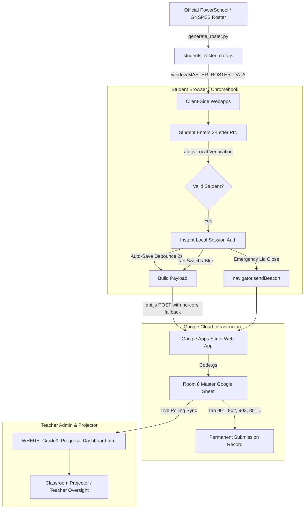

# Student System — Authentication, Roster & Cloud Data Engine

**Teacher:** Mr. Dave Waugh  
**Room:** Room 8, Bicentennial Junior High School ("BiHi"), Dartmouth, Nova Scotia  
**Academic Cohort:** 2026–2027  
**Supported Classes:** Classes 801, 802, 803, 804, 901, 902 (Homeroom), 903, 7 ILT  

---

## 1. Directory Purpose & LLM Context

This folder contains the **centralized identity, authentication, local datastore, and cloud persistence infrastructure** powering all interactive student applications across Citizenship 9, Healthy Living 8, Healthy Living 9, and ILT.

### The Core Architectural Problem Solved:
In this school environment, students use **shared mobile Chromebook carts** that rotate between classrooms every period. These devices frequently run in guest mode or wipe browser storage upon logout. Students rarely sit at the same physical computer twice in a week, making standard browser `localStorage` insufficient on its own.

The `Student_System` solves this with a **lightweight, zero-friction 3-letter PIN authentication and automated cloud synchronization system**.

---

## 2. Core Architecture & Data Flow

---

## 3. Key Files & Components

### A. Client API & Session Management (`api.js`)
* **`StudentAPI.resolveStudent(className, enteredName, enteredPin)`:** Performs fuzzy matching across student names and exact 3-letter PINs.
* **`StudentAPI.validateStudent(className, firstName, pin)`:** Validates student against the official roster completely offline.
* **`StudentAPI.login(className, firstName, pin, courseKey)`:** Authenticates the session and fetches existing cloud drafts.
* **`StudentAPI.submitProfile(taskName, profileData, summaryText, courseKey)`:** Pushes payloads to Google Apps Script. Features a **guaranteed `mode: 'no-cors'` fallback** to bypass school proxy and browser CORS redirect blocks, ensuring zero student work is ever lost.

### B. Cloud Webhook Backend (`Code.gs`)
* **Endpoint:** `https://script.google.com/macros/s/AKfycbzsfWqIHC5ToS-6tYPexArJ6SvW0NAChEnZR5YQmwkK4MYm1CMD-zqgleTTDqLMcPsW/exec`
* **Features:**
  * Auto-creates and routes rows into dedicated class tabs: `901`, `902`, `903`, `801`, `802`, `803`, `804`, `Lockers_902`.
  * Preserves past student work via JSON merging (`mergedData._tasks[taskName]`) so multiple assignments do not overwrite each other.
  * Supports both `doPost(e)` (saves and login) and `doGet(e)` (GET queries).

### C. Roster Datastores
* `students_roster_data.js` — Client-side JavaScript file that injects `window.MASTER_ROSTER_DATA` into the global scope. Eliminates login latency.
* `students_roster.json` & `students_roster.csv` — Structured master rosters containing full names, PINs, homerooms, and course enrollments.
* `generate_roster.py` — Python utility script used by the teacher to ingest new school enrollment lists and re-generate the PINs and JavaScript data files.

### D. Administrative Dashboards & Teacher Tools
* `WHERE_Grade9_Progress_Dashboard.html` — Live progress command center for Citizenship 9. Features Leaflet global pin map, metric totals, live Google Sheets synchronization (`🔄 Sync Live Cloud Data`), and student work modals.
* `teacher_pin_kiosk.html` — Emergency teacher PIN lookup kiosk for quick retrieval during class.
* `student_pins_printable.html` — Printable 3-letter PIN wallet cards to distribute to students.
* `Room8_Chromebook_Assignments_All_Classes.html` — Single launchpad display listing every active digital assignment for all periods.

### E. Reusable Assignment Template (`_TEMPLATE_GAS_Assignment.html`)
* Copy-paste starting point for **any new GAS-enabled assignment** (Citizenship 9, HL 8/9, ILT). Packs the full persistence engine proven in the HL9 10-Station Audit: PIN login + lookup, instant local autosave, 4s debounced cloud autosave, cross-device Google Sheets recovery, Chromebook draft banner, JSON/Markdown/print exports, and the cloud-save certificate.
* **Assignment content is data, not code:** edit the `ASSIGNMENT` config at the top of the `<script>` block — `course` ('HL9'/'CIT9'), unique `taskName` (how work is filed on the Google Sheet), title/subtitle, class list, and `sections[]` of fields (`text`, `textarea`, `select`, `chips`). Rendering, progress, restore, and exports are generated from that schema.
* **To use:** copy the file into `HealthyLiving9/` or `Citizenship 9/`, switch the two dependency `<script src>` tags to `../Student_System/…` (instructions are in the file header), and fill in the config. No `Code.gs` changes needed — submissions file themselves under `_tasks[taskName]`. Teacher demo PINs (TST/WAU/DEV/MRW) work for testing.

---

## 4. Technical Constraints for LLMs Modifying This Folder

1. **Roster Immutability:** Do not alter active student PINs in `students_roster_data.js` without explicit instructions; students have physical cards with these exact codes.
2. **CORS Resilience:** Google Apps Script webhooks issue `302 Found` redirects. Browsers running on GitHub Pages (`*.github.io`) will block reading redirected responses under strict CORS. Always include `mode: 'no-cors'` and `navigator.sendBeacon` fallbacks when writing data to the webhook.
3. **No External Frameworks:** All client files must remain vanilla JS and pure CSS to ensure instant loading on school network bandwidth.
