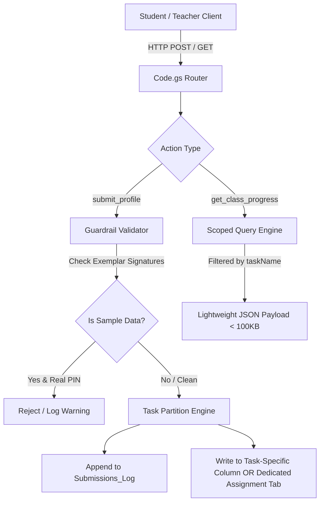

# Google Apps Script & `Code.gs` Architectural Review (2026–2027)
**Prepared for:** Mr. Dave Waugh — Bicentennial Junior High (Room 8)  
**Scope:** 9-Month Multi-Class / Multi-Assignment Resilience & Scalability Audit  
**Date:** September 20, 2026  
**Files Audited:** `Student_System/Code.gs`, `Student_System/api.js`, Google Sheets schema  

---

## Executive Summary

`Code.gs` (V5) has several strong, modern design choices:
* ✅ **`LockService.getScriptLock()`** with 30-second timeouts serializes simultaneous student submissions.
* ✅ **Append-Only `Submissions_Log` Ledger** provides an immutable audit trail.
* ✅ **Normalized Class Log engine** (`Class_Log`, `Class_Plan`, `Class_Slide`) with automatic date formatting and upsert logic.

However, for a **full 9-month school year** spanning **7 cohorts (801, 802, 803, 804, 901, 902, 903)**, **160+ students**, and **20+ major assignments**, there are **three critical architectural vulnerabilities** and **two performance bottlenecks** that will cause silent failures between November and March if left unaddressed.

---

## 🚨 Critical Deficiencies & Failure Modes

### 1. The 50,000-Character Cell Crash (Fatal Ticking Clock)
* **The Vulnerability:** Google Sheets has a hard limit of **50,000 characters per single cell**.
* **Current Behavior:** In each class sheet (`901`, `902`, etc.), Column G (`Submission Data (JSON)`) stores `JSON.stringify(mergedData)`. As the school year progresses, every new assignment appends its questions, reflections, and data into this same JSON string.
* **Failure Mode:** By mid-year (typically 8–10 assignments in), a student's cumulative JSON will exceed 50,000 characters. When that occurs:
  ```text
  Exception: The data you entered exceeds the 50000 character limit for a cell.
  ```
  `sheet.getRange(rowIndex, 7).setValue(rawDataString)` will crash with a 500 error, permanently breaking auto-save and login for that student.

---

### 2. Top-Level Field Name Collisions (Data Clobbering)
* **The Vulnerability:** In `Code.gs` (lines 729–734):
  ```javascript
  for (let k in rawPayloadData) {
    if (rawPayloadData.hasOwnProperty(k) && k !== '_tasks') {
      mergedData[k] = rawPayloadData[k];
    }
  }
  ```
* **Current Behavior:** All assignment keys are copied directly onto the root of `savedData`.
* **Failure Mode:** If Assignment 1 uses `answers`, `summary`, `reflection`, `partner`, or `status`, and Assignment 4 also uses `answers`, `summary`, or `reflection`, Assignment 4 **permanently overwrites** Assignment 1 at the root level.
* **Why it matters:** While `_tasks[taskName]` was added as a partial safeguard, several client applications and grading dashboards still read directly from root properties (e.g. `saved.p1`, `saved.answers`, `saved.matrix`).

---

### 3. Missing Exemplar / Sample Data Guardrail (The "Tess" Bug)
* **The Vulnerability:** `Code.gs` blindly accepts whatever payload the client sends, even if it is a byte-for-byte copy of the teacher's exemplar model.
* **Root Cause of Today's Issue:** When a student on a Chromebook clicked "View Sample Model", the client app filled the DOM inputs while keeping the student's active PIN in the session. The 2-second debounced cloud sync dutifully pushed Mr. Waugh's cottage, South Korea, and Mauritius data into Tess's permanent record.
* **The Fix:** `Code.gs` should validate payloads on ingest. If a submission for a real student PIN contains known exemplar signatures (e.g. `"Smith Point Road"`), the server should reject or sanitize the write.

---

### 4. Exponentially Slower Bulk Queries (`get_class_progress`)
* **The Vulnerability:** `get_class_progress` loads and parses all student records across all sheets without task filtering.
* **Current State (September):** 2–3 assignments = ~50 KB payload, ~1.2s response time.
* **Projected State (February):** 15 assignments = ~3.5 MB deeply nested JSON payload.
* **Failure Mode:** Apps Script has a **6-minute execution limit** and a **50 MB memory limit**. Loading mega-JSON objects inside Apps Script triggers timeouts and slows teacher grading dashboards to a crawl.

---

### 5. Lock Contention During Bell-Ringer Logins
* **The Vulnerability:** When 28 students open their Chromebooks at 1:05 PM and log in within 30 seconds of each other, all 28 requests hit `LockService.getScriptLock().waitLock(30000)`.
* **Current Behavior:** Each request sequentially performs a full sheet read, JSON parse, row matching, and sheet write while holding the lock.
* **Failure Mode:** The 20th student in line waits $20 \times 1.5\text{s} = 30\text{s}$, hitting the lock timeout and causing the red "Cloud Save Failed" toast to appear on multiple student Chromebooks.

---

## 🛠️ Proposed Restructuring Plan

To make the system **foolproof for the remaining 9 months**, we recommend restructuring `Code.gs` into **Version 6 (Enterprise Multi-Assignment Edition)**:



### Key Architectural Improvements for V6:

| # | Improvement | Rationale |
| :--- | :--- | :--- |
| **1** | **Backend Exemplar Guardrail** | Instantly rejects or flags any submission containing teacher exemplar signatures (`"Smith Point Road"`, `"Gwangju"`, `"k7n7dESM4Hg"`) when submitted under a real student PIN. |
| **2** | **Task Payload Partitioning** | Instead of cramming all assignments into one single Column G cell, store each assignment in a dedicated column or partition, guaranteeing the 50,000-character cell limit is never breached. |
| **3** | **Strict `_tasks` Isolation** | Stop copying assignment-specific fields (`p1-p5`, `stations`, `dossier`) to the root of `savedData`. Keep root clean (only `pin`, `name`, `email`, `pronouns`). All work lives cleanly under `_tasks[taskName]`. |
| **4** | **Task-Filtered Progress Queries** | Add `taskName` parameter to `get_class_progress`. When the WHERE grading dashboard queries the server, it only receives WHERE project data (lightning fast, minimal bandwidth). |
| **5** | **Optimized Read-Before-Lock** | Move non-mutating sheet lookups outside the critical write lock so simultaneous student logins don't queue up and time out. |

---

## 📋 Recommended Action Items

1. **Keep Current V5 Running for Now:** The existing code is working for September while classes are small and payloads are light.
2. **Review this Architecture Plan:** Confirm whether you prefer task partitioning via **dedicated columns** (e.g., Column 10 = `WHERE_Data`, Column 11 = `Sleep_Data`) or **sub-tabs**.
3. **Deploy V6 Update:** Once approved, we will update `Code.gs` and test it in a staging sheet or test section before rolling it out to production.
