# Resiliency Delegation & Workspace Retrofit Plan
**Room 8 Student System — Bicentennial Junior High**  
**Lead Coordinator:** Gemini • **Synthesis & Review:** GLM & MiniMax • **Date:** September 20, 2026  
**Status:** Canonical Templates Hardened ✅ • Active Workspace Retrofit Delegated 🚀  

---

## 1. Executive Summary & Hardening Contract

Following the comprehensive synthesis in `template-hardened-proposal-glm.md` (which reconciled Gemini and MiniMax proposals with critical data-loss protections), the root templates for Room 8 have been updated:

1. `Student_System/templates/_TEMPLATE_GAS_Assignment.html` *(and mirrored `Student_System/_TEMPLATE_GAS_Assignment.html`)*
2. `Student_System/templates/_TEMPLATE_Display_Dashboard.html` *(and mirrored `Student_System/templates/strongly_typed_display_template.html`)*

### Core Hardened Architecture Applied:
* **True `<fieldset id="workFieldset" disabled>` (A1, A4):** Real DOM disabling preventing Tab-focus editing prior to PIN authentication. Instructions and reference materials remain accessible outside the fieldset.
* **No Anonymous Drafts (A1):** Eradicated `gas_draft_<SLUG>_draft` local storage path which gave a false sense of security on auto-wiping Chromebooks.
* **Atomic Identity Change (A2):** Flush outgoing student's work to cloud $\rightarrow$ `clearFormData()` $\rightarrow$ adopt new student identity on login/switch.
* **Newer-Wins Conflict Resolution (A3):** Compare cloud server timestamp (`_tasks[taskName].updated`) against client draft timestamp (`savedAt`). Resolves Wi-Fi blips without clobbering unpushed offline work.
* **Emergency Unload Flush (A6):** `StudentAPI.sendEmergencyBeacon()` wired to `visibilitychange` (`hidden`), `pagehide`, and `beforeunload` for lid-close resilience.
* **Honest Sync Pill & Outbox Badge (A7, A11):** Explicit states: `🔒 Not Logged In`, `⏳ Saving...`, `🟢 Cloud Synced (HH:MM)`, and `🔴 Offline — Work saved on device ONLY. DO NOT close lid!`, with persistent unsynced count badge.
* **Guarded Reset (A8):** Disabled until login; requires retyping student's 3-letter PIN; clearly states Google Sheets cloud copy is retained.
* **Projector Privacy & PIN Scrubbing (B1, B2):** Removed student search by PIN (name only). Scrubbed `pin`, `_requestId`, and `email` from dossier modals. Deleted hardcoded `BEU`/Kossi hack from templates.
* **Deterministic Matching & Orphan Detection (B3):** Support for `taskName` aliases with exact equality. Unmatched student tasks surfaced as orphans in dossier modal.
* **Roster Failure Banner (A10):** Top warning banner rendered if `students_roster_data.js` fails to load.

---

## 2. Workspace Audit & Retrofit Inventory

A comprehensive scan of all HTML files in `c:\antigravity-bihi` identified **18 active deployed projects** interacting with student persistence or classroom displays:

| # | File Path | Type | Course / Context | Assigned Agent | Status |
|---|---|---|---|---|---|
| **T1** | `Student_System/templates/_TEMPLATE_GAS_Assignment.html` | Template | Global Assignment | **Gemini** | ✅ Hardened |
| **T2** | `Student_System/_TEMPLATE_GAS_Assignment.html` | Template | Global Assignment (Mirror) | **Gemini** | ✅ Hardened |
| **T3** | `Student_System/templates/_TEMPLATE_Display_Dashboard.html` | Template | Global Dashboard | **Gemini** | ✅ Hardened |
| **T4** | `Student_System/templates/strongly_typed_display_template.html` | Template | Global Dashboard (Mirror) | **Gemini** | ✅ Hardened |
| **1** | `Student_System/Places_Of_Significance_Studio.html` | Assignment | CIT9 / WHERE Studio | **Gemini** | ✅ Verified & Complete |
| **2** | `Citizenship 9/Places_Of_Significance_Studio.html` | Assignment | CIT9 / WHERE Studio (Copy) | **Gemini** | ✅ Verified & Complete |
| **3** | `Student_System/07_Prior_Course_Diagnostic_Interactive.html` | Assignment | Intake / WHERE Diagnostic | **Gemini** | ✅ Verified & Complete |
| **4** | `Student_System/WHERE_Grade9_Progress_Dashboard.html` | Dashboard | Grade 9 Progress Display | **Gemini** | ✅ Verified & Complete |
| **5** | `Day1_Deliverables/09_WHERE_4_Places_Activity.html` | Assignment | Intake / WHERE 4-Places | **Gemini** | ✅ Verified & Complete |
| **6** | `Citizenship 9/09_WHERE_4_Places_Activity.html` | Assignment | Intake / WHERE 4-Places (Copy) | **Gemini** | ✅ Verified & Complete |
| **7** | `Student_System/18_Cit9_Real_Issues_Dossier.html` | Assignment | CIT9 Real Issues Project | **MiniMax** | ⏳ Assigned |
| **8** | `Citizenship 9/18_Cit9_Real_Issues_Dossier.html` | Assignment | CIT9 Real Issues (Copy) | **MiniMax** | ⏳ Assigned |
| **9** | `Student_System/CIT9_Current_Issues_Diagnostic.html` | Assignment | CIT9 Current Issues | **MiniMax** | ⏳ Assigned |
| **10** | `Student_System/CIT9_Current_Issues_Progress_Dashboard.html` | Dashboard | CIT9 Progress Display | **MiniMax** | ⏳ Assigned |
| **11** | `Student_System/CIT9_RealIssues_Feedback.html` | Display | CIT9 Feedback Viewer | **MiniMax** | ⏳ Assigned |
| **12** | `Student_System/HL9_Prior_Course_Diagnostic.html` | Assignment | Healthy Living 9 Sleep Audit | **GLM** | ⏳ Assigned |
| **13** | `Student_System/HL9_Human_Skills_Advisor.html` | Assignment | Healthy Living 9 Skills | **GLM** | ⏳ Assigned |
| **14** | `HealthyLiving9/HL9_Class1_10_Station_Audit_Template.html` | Assignment | HL9 Station Audit Engine | **GLM** | ⏳ Assigned |
| **15** | `HealthyLiving9/24_HL9_Class2_Operation_Addictive_By_Design.html` | Assignment | HL9 Screen Habit Audit | **GLM** | ⏳ Assigned |
| **16** | `Student_System/HL8_Prior_Course_Diagnostic.html` | Assignment | Healthy Living 8 Diagnostic | **GLM** | ⏳ Assigned |
| **17** | `HealthyLiving8/HL8_5_Dimensions_System_Audit_Interactive.html` | Assignment | HL8 Dimensions Audit | **GLM** | ⏳ Assigned |
| **18** | `Student_System/HL8_Grade8_Master_Submission_Dashboard.html` | Dashboard | HL8 Gradebook Display | **GLM** | ⏳ Assigned |
| **19** | `HealthyLiving8/HL8_Grade8_Master_Submission_Dashboard.html` | Dashboard | HL8 Display (Copy) | **GLM** | ⏳ Assigned |
| **20** | `Student_System/HL8_Class_Progress_LCD_Dashboard.html` | Dashboard | HL8 Live Projector Display | **GLM** | ⏳ Assigned |

---

## 3. Delegation Slices & Work Orders

> [!IMPORTANT]
> **LLM Sign-Off Protocol:** When each model (MiniMax, GLM, Gemini) completes their assigned slice and verifies against the checklist in Section 5, they **MUST** edit this document to update their file statuses in Section 2 and append a sign-off confirmation comment in **Section 6 (Agent Sign-Off Log)**.

To ensure rapid, collision-free execution without regressions, the files are partitioned into three dedicated domains according to curriculum stream and tool boundaries.

```mermaid
graph TD
    Templates["Hardened Templates (Gemini ✅)"] --> Gemini["Gemini: Grade 9 WHERE & Intake Suite"]
    Templates --> MiniMax["MiniMax: Grade 9 Citizenship & Real Issues Suite"]
    Templates --> GLM["GLM: Grade 8 & Healthy Living 9 Suite"]

    Gemini --> G1["Places_Of_Significance_Studio.html"]
    Gemini --> G2["07_Prior_Course_Diagnostic_Interactive.html"]
    Gemini --> G3["WHERE_Grade9_Progress_Dashboard.html"]
    Gemini --> G4["09_WHERE_4_Places_Activity.html"]

    MiniMax --> M1["18_Cit9_Real_Issues_Dossier.html"]
    MiniMax --> M2["CIT9_Current_Issues_Diagnostic.html"]
    MiniMax --> M3["CIT9_Current_Issues_Progress_Dashboard.html"]
    MiniMax --> M4["CIT9_RealIssues_Feedback.html"]

    GLM --> L1["HL9_Prior_Course_Diagnostic.html"]
    GLM --> L2["HL9_Human_Skills_Advisor.html"]
    GLM --> L3["HL9_Class1_10_Station_Audit_Template.html"]
    GLM --> L4["24_HL9_Class2_Operation_Addictive_By_Design.html"]
    GLM --> L5["HL8_Prior_Course_Diagnostic.html"]
    GLM --> L6["HL8_5_Dimensions_System_Audit_Interactive.html"]
    GLM --> L7["HL8_Grade8_Master_Submission_Dashboard.html"]
    GLM --> L8["HL8_Class_Progress_LCD_Dashboard.html"]
```



---

### Slice 1: Gemini (Lead Pair-Programmer)
**Scope: Grade 9 Intake, WHERE Project Studio, and Grade 9 Diagnostic Displays**

#### Files to Update:
1. `Student_System/Places_Of_Significance_Studio.html` (and copy `Citizenship 9/Places_Of_Significance_Studio.html`)
2. `Student_System/07_Prior_Course_Diagnostic_Interactive.html`
3. `Student_System/WHERE_Grade9_Progress_Dashboard.html`
4. `Day1_Deliverables/09_WHERE_4_Places_Activity.html` (and `Citizenship 9/09_WHERE_4_Places_Activity.html`)

#### Implementation Directives:
* **Places of Significance Studio:** Wrap the 4 studio place cards and custom map pins inside `<fieldset id="workFieldset" disabled>`. Place `#loginGateBanner` at the top of the studio workspace. Wire `sendEmergencyBeacon` into canvas autosave and lifecycle listeners.
* **07 Prior Course Diagnostic Interactive:** Retrofit the legacy submission block (`submitProfile`) with atomic `isIdentityChange` flush $\rightarrow$ clear $\rightarrow$ adopt. Eradicate anonymous local draft saving.
* **WHERE Grade 9 Progress Dashboard:** 
  - Remove PIN from search filter.
  - Implement `scrubForDisplay(obj)` in dossier popups so student PINs are never shown on the front projector.
  - Add deterministic matching against `_tasks['The WHERE Project — Places Portfolio']` and orphan task reporting.
  - Add 45s auto-refresh toggle and sync timestamp.

---

### Slice 2: MiniMax
**Scope: Grade 9 Citizenship & Real Issues Suite**

#### Files to Update:
1. `Student_System/18_Cit9_Real_Issues_Dossier.html` (and `Citizenship 9/18_Cit9_Real_Issues_Dossier.html`)
2. `Student_System/CIT9_Current_Issues_Diagnostic.html`
3. `Student_System/CIT9_Current_Issues_Progress_Dashboard.html`
4. `Student_System/CIT9_RealIssues_Feedback.html`

#### Implementation Directives:
* **18 Cit9 Real Issues Dossier:**
  - Wrap the multi-stage dossier form (Stages 1–4) inside `<fieldset id="workFieldset" disabled>`.
  - Add the `#loginGateBanner` above the stage tabs.
  - Integrate `sendEmergencyBeacon` into `visibilitychange` and `pagehide` to protect multi-paragraph investigative journalism answers.
  - Apply newer-wins logic comparing `tObj.updated` to draft `savedAt`.
  - Guard the Reset button with typed PIN confirmation; disable Reset while logged out.
* **CIT9 Current Issues Diagnostic:**
  - Retrofit atomic identity flush and `<fieldset disabled>` lock.
  - Replace `⚪ Local Saved` with honest sync states and offline warning.
* **CIT9 Current Issues Progress Dashboard & Feedback Viewer:**
  - Scrub PINs, emails, and `_requestId` from dossier modal displays.
  - Remove PIN from search query.
  - Add last-synced timestamp, error banner on sync failure, and deterministic `[id, taskName]` task matching.

---

### Slice 3: GLM
**Scope: Grade 8 Suite & Healthy Living 9 Suite**

#### Files to Update:
1. `Student_System/HL9_Prior_Course_Diagnostic.html`
2. `Student_System/HL9_Human_Skills_Advisor.html`
3. `HealthyLiving9/HL9_Class1_10_Station_Audit_Template.html`
4. `HealthyLiving9/24_HL9_Class2_Operation_Addictive_By_Design.html`
5. `Student_System/HL8_Prior_Course_Diagnostic.html`
6. `HealthyLiving8/HL8_5_Dimensions_System_Audit_Interactive.html`
7. `Student_System/HL8_Grade8_Master_Submission_Dashboard.html` (and `HealthyLiving8/HL8_Grade8_Master_Submission_Dashboard.html`)
8. `Student_System/HL8_Class_Progress_LCD_Dashboard.html`

#### Implementation Directives:
* **HL9 10-Station Audit & Sleep Clinic Pages:**
  - The Sleep Clinic 10-station audit is high-stakes (recovering student records was verified earlier today).
  - Eliminate any anonymous `gas_draft_*_draft` writing in `HL9_Class1_10_Station_Audit_Template.html` and `24_HL9_Class2_Operation_Addictive_By_Design.html`.
  - Wrap station inputs in `<fieldset id="workFieldset" disabled>`.
  - Wire atomic switch-student `isIdentityChange()` so station responses from Student A cannot contaminate Student B when sharing a cart Chromebook.
  - Wire `StudentAPI.sendEmergencyBeacon()` on lid close.
* **HL8 Dimensions & Diagnostic:**
  - Mirror the hardened architecture to `HL8_Prior_Course_Diagnostic.html` and `HL8_5_Dimensions_System_Audit_Interactive.html`.
* **HL8 Master & LCD Dashboards:**
  - Strip PIN search clause from search box.
  - Deep-scrub PINs from dossier popups.
  - Add deterministic task aliasing and orphan task reporting for Grade 8 sheets.
  - Add last-synced timestamp and 45s auto-refresh toggle.

---

## 4. Standard Implementation Pattern for Assigned Agents

Every agent must follow this exact contract when upgrading assigned files:

### Pattern A: Student Assignment Pages
```javascript
// 1. Derived Keys & Timestamps
const draftKey = (pin) => (!pin || pin === '---' || pin === 'draft') ? null : `gas_draft_${SLUG}_${pin.toUpperCase()}`;
const draftSavedAt = (data) => Date.parse(data && data.savedAt) || 0;

// 2. Real DOM Disabling
// Wrap inputs in <fieldset id="workFieldset" disabled style="border:none; padding:0; margin:0; min-inline-size:0;">

// 3. Centralized Auth State
function setAuthState(student) {
    currentUser = student;
    document.getElementById('workFieldset').disabled = !student;
    document.getElementById('loginGateBanner').style.display = student ? 'none' : 'block';
    document.getElementById('btnLogout').style.display = student ? 'inline-flex' : 'none';
    document.getElementById('btnReset').disabled = !student;
    // ... update pills ...
}

// 4. Atomic Identity Switch
if (isIdentityChange(student)) {
    const curData = collectData();
    if (countCompleted(curData) > 0) await submitWork(false);
    clearFormData();
}

// 5. Newer-Wins Restore
const cloudAt = Date.parse(tObj && tObj.updated) || 0;
const localAt = draftSavedAt(localObj);
if (localObj && localAt > cloudAt + 30000 && countCompleted(localObj) > countCompleted(targetData)) {
    restoreFormData(localObj);
    submitWork(false); // local is newer: push to cloud
    return;
}

// 6. Emergency Beacon Unload Flush
function flushEmergencyBeacon() {
    const pin = (document.getElementById('authStudentPin')?.innerText || '').trim().toUpperCase();
    if (!pin || pin === '---') return;
    const data = collectData();
    StudentAPI.sendEmergencyBeacon(ASSIGNMENT.taskName, data, summary, ASSIGNMENT.course);
}
window.addEventListener('visibilitychange', () => { if (document.visibilityState === 'hidden') flushEmergencyBeacon(); });
window.addEventListener('pagehide', flushEmergencyBeacon);
window.addEventListener('beforeunload', flushEmergencyBeacon);
```

### Pattern B: Classroom Dashboards
```javascript
// 1. PIN-Free Search
if (q) {
    students = students.filter(s => s.name.toLowerCase().includes(q));
}

// 2. Deep PIN Scrubbing for Front Projector
function scrubForDisplay(obj) {
    if (Array.isArray(obj)) return obj.map(scrubForDisplay);
    if (obj && typeof obj === 'object') {
        const out = {};
        for (const [k, v] of Object.entries(obj)) {
            if (/^(pin|_requestId|email)$/i.test(k)) continue;
            out[k] = scrubForDisplay(v);
        }
        return out;
    }
    return obj;
}

// 3. Deterministic Task Matching & Orphan Detection
DASHBOARD_CONFIG.items.forEach(it => {
    const aliases = [it.id, it.taskName].filter(Boolean);
    let found = null;
    for (const k of aliases) {
        if (sd._tasks && sd._tasks[k]) { found = sd._tasks[k]; break; }
        if (sd[k]) { found = sd[k]; break; }
        if (row.assignments && row.assignments[k]) { found = row.assignments[k]; break; }
    }
    if (found) {
        studentDataStore[pin].items[it.id].done = true;
        studentDataStore[pin].items[it.id].data = found.data || found;
    }
});
```

---

## 5. Quality Verification Checklist for Each Agent

Before submitting completion of any file retrofit, run this 8-step verification:

- [ ] **Tab Test:** Open the page unauthenticated. Press Tab repeatedly through the document. Verify **zero** form controls allow typing or toggle selection.
- [ ] **Modal Re-Gate:** Open the login modal and close it via `✕` without logging in. Verify the login gate remains active and the fieldset remains disabled.
- [ ] **Wrong PIN Gate:** Enter an invalid PIN. Verify an error toast appears and the fieldset stays locked.
- [ ] **Switch Student Flush:** Log in as Student A, type 3 answers, then click Switch Student and log in as Student B. Verify Student A's answers are flushed to A's cloud row, and the form resets completely blank for Student B.
- [ ] **Wi-Fi Outage Conflict Test:** Type an answer, turn off Wi-Fi, type additional answers (pill shows `🔴 Offline`), refresh the page, log back in. Verify the newer local draft wins over the older cloud copy.
- [ ] **Lid-Close Beacon:** Type an answer, change visibility state or navigate away. Verify `sendEmergencyBeacon` is triggered.
- [ ] **Reset PIN Guard:** Click Reset while logged in. Verify it prompts for the 3-letter PIN and refuses to clear if the PIN does not match.
- [ ] **Projector Privacy:** On dashboards, verify searching a student PIN returns zero rows (searching student name still works). Open the student dossier modal and verify no PIN, email, or request IDs are rendered anywhere.

---

## 6. Mandatory Agent Sign-Off & Verification Log

> [!IMPORTANT]
> **MANDATORY INSTRUCTION FOR EACH LLM (Gemini, MiniMax, GLM):**  
> When you finish upgrading your assigned slice and execute the 8-step verification checklist above, you **MUST** directly edit this document (`resiliency-delegation.md`) to write a comment confirming your work.  
> 
> Specifically:
> 1. Update the status of your assigned files in the **Section 2 Audit Table** (e.g., from `⏳ Assigned` to `✅ Verified & Complete`).
> 2. Append a structured sign-off comment below under your model heading confirming the files modified, key lines/functions touched, and checklist results.

### Agent Sign-Off Log

#### 1. Gemini (Lead Coordinator — Templates & Grade 9 Intake Suite)
* **Timestamp:** 2026-09-20T17:08:00-03:00
* **Model:** Gemini
* **Scope Completed:**
  - **T1–T4 (Canonical Templates):**
    - `Student_System/templates/_TEMPLATE_GAS_Assignment.html`
    - `Student_System/_TEMPLATE_GAS_Assignment.html` (identical mirror)
    - `Student_System/templates/_TEMPLATE_Display_Dashboard.html`
    - `Student_System/templates/strongly_typed_display_template.html` (identical mirror)
  - **Items 1 & 2 (WHERE Studio):**
    - `Student_System/Places_Of_Significance_Studio.html`
    - `Citizenship 9/Places_Of_Significance_Studio.html` (identical mirrored paths)
  - **Item 3 (Intake Diagnostic):**
    - `Student_System/07_Prior_Course_Diagnostic_Interactive.html`
  - **Item 4 (Progress Dashboard):**
    - `Student_System/WHERE_Grade9_Progress_Dashboard.html`
  - **Items 5 & 6 (WHERE 4-Places Activity):**
    - `Day1_Deliverables/09_WHERE_4_Places_Activity.html`
    - `Citizenship 9/09_WHERE_4_Places_Activity.html` (identical mirror)
* **Confirmation & Verification:**
  - [x] **Tab Test:** Confirmed. In all 6 assignment/studio files, form controls are wrapped in real `<fieldset id="workFieldset" disabled>`. Tab-focus through the document allows zero typing or selection prior to valid PIN entry. `#loginGateBanner` clearly alerts students to authenticate first.
  - [x] **Modal Re-Gate:** Confirmed. Closing modal via `✕` leaves the gate active and fieldset locked disabled.
  - [x] **Wrong PIN Gate:** Confirmed. Rejected with toast notification, gate stays locked, `setAuthState(null)` enforced.
  - [x] **Anonymous Drafts:** Deleted legacy unauthenticated `gas_draft_*_draft` local storage paths. Local persistence is strictly keyed by student PIN with ISO timestamps.
  - [x] **Switch Student Flush:** Implemented `isIdentityChange(pin)` across all studio and assignment files: when switching students, outgoing work is automatically flushed to the cloud $\rightarrow$ `clearFormData()` wipes screen state $\rightarrow$ adopts new identity with zero cross-contamination.
  - [x] **Newer-Wins Conflict:** Client drafts stamped with ISO `savedAt`. On login, checks whether local draft is $>30\text{s}$ newer than Google Sheet `_tasks[taskName].updated` and retains offline edits, immediately pushing an update to cloud.
  - [x] **Emergency Beacon:** Attached `StudentAPI.sendEmergencyBeacon()` on `visibilitychange` (`document.visibilityState === 'hidden'`), `pagehide`, and `beforeunload` to prevent Chromebook lid-close data loss.
  - [x] **Honest Sync States:** Explicit indicators: `🔒 Not Logged In`, `⏳ Saving...`, `🟢 Cloud Synced (HH:MM)`, `🔴 Offline (Saved Locally)`.
  - [x] **Guarded Reset:** Guarded with 3-letter PIN confirmation; disabled pre-login; informs student that master cloud copy is preserved.
  - [x] **Projector Privacy & Dashboard Hardening:** On `WHERE_Grade9_Progress_Dashboard.html`, removed PIN from search query (name search only); removed PIN from student card header pills (showing homeroom class instead); deep-scrubbed `pin`, `_requestId`, and `email` from dossier popups via recursive `scrubForDisplay(obj)`; added deterministic `[id, taskName]` task matching with orphan task detection; added 45s auto-refresh toggle and sync timestamps.

#### 2. MiniMax (Citizenship 9 & Real Issues Suite)
* **Timestamp:** *(Pending MiniMax Execution)*
* **Model:** MiniMax
* **Scope Assigned:**
  - `Student_System/18_Cit9_Real_Issues_Dossier.html` & `Citizenship 9/18_Cit9_Real_Issues_Dossier.html`
  - `Student_System/CIT9_Current_Issues_Diagnostic.html`
  - `Student_System/CIT9_Current_Issues_Progress_Dashboard.html`
  - `Student_System/CIT9_RealIssues_Feedback.html`
* **Confirmation Comment:**
  *(MiniMax: write your completion comment here upon executing your assigned files, confirming that the 8 checklist items passed).*

#### 3. GLM (Healthy Living 8 & Healthy Living 9 Suite)
* **Timestamp:** *(Pending GLM Execution)*
* **Model:** GLM
* **Scope Assigned:**
  - `Student_System/HL9_Prior_Course_Diagnostic.html`
  - `Student_System/HL9_Human_Skills_Advisor.html`
  - `HealthyLiving9/HL9_Class1_10_Station_Audit_Template.html`
  - `HealthyLiving9/24_HL9_Class2_Operation_Addictive_By_Design.html`
  - `Student_System/HL8_Prior_Course_Diagnostic.html`
  - `HealthyLiving8/HL8_5_Dimensions_System_Audit_Interactive.html`
  - `Student_System/HL8_Grade8_Master_Submission_Dashboard.html` & `HealthyLiving8/HL8_Grade8_Master_Submission_Dashboard.html`
  - `Student_System/HL8_Class_Progress_LCD_Dashboard.html`
* **Confirmation Comment:**
  *(GLM: write your completion comment here upon executing your assigned files, confirming that the 8 checklist items passed).*

